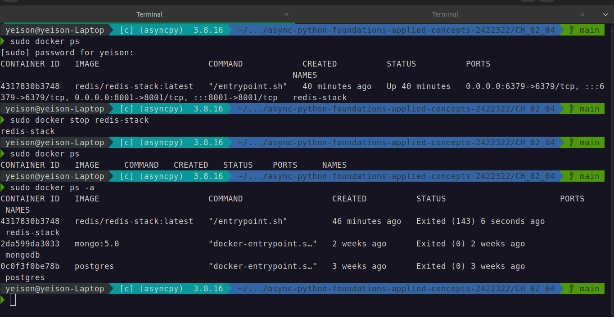

# **Terminal**
## what is a command?
A command is a program that you can run from the terminal, it is also a utility of the shell, a shell function, or an alias. A command can receive arguments and options.
## what is a command line (shell)?
A shell is a command line interpreter, it is a program that reads commands from the keyboard and executes them.
- Bourne shell (sh)
- Bash shell (bash)
- C shell (csh)
- Korn shell (ksh)
- Z shell (zsh)
- Fish shell (fish)
- PowerShell (powershell)
## what is a terminal?
A terminal is a program that allows you to interact with the shell.
- flexibility
- velocity
- No GUI

---

## Commands
### **ls**
- `ls -al` : list files in long format, including hidden files
- `ls -lrt` : list files in long format, sorted by date
- `ls -lh` : list files in long format, with human readable sizes
### **tree** : list files in a tree format
- `tree -L 2` : list files in a tree format, 2 levels deep.
### **cd [path]**
- `cd` : move to home directory
- `cd - `: change directory to previous directory
- `cd ..` : change directory to parent directory
- `cd /` : change directory to root directory
- `cd <path>`: change directory to the specified path
- `cd ~<user> `: change directory to user's home directory
- `cd ~`: change directory to current user's home directory
### **pwd** (print working directory)
- `pwd`

## **managing files**

### **touch**
- `touch file_name`: create file_name file.
- `touch file_1_name file_2_name` : create file1 and file2
- `> file_name` : create file

### **cp**
- `cp file_name file_name_copy`: copy file_name to file_name_copy.
- `cp -r dir_name dir_name_copy`: copy dir_name to dir_name_copy.
- `cp -p` : copy files preserving attributes
- `cp -a` : copy files preserving attributes and links
- `cp -i` : prompt before overwriting existing files
- `cp -f` : force overwrite existing files

### **mv**
- `mv <file_name> <path>` : move file to specified path
- `mv <file1> <file2>` : rename file1 to file2
- `mv -i` : prompt before overwriting existing files
- `mv -f` : force overwrite existing files
- `mv <dir1> <path> `: move dir1 to specified path
- `mv {path}/* mv {path}/.* {path}/`: move all files and even hidden ones to specified path.

### **rm**
- `rm <file_name>`: delete file_name.
- `rm -r <dir_name>`: delete dir_name.
- `rm -rf <dir_name>`: delete dir_name and its contents.

### **mkdir**
- `mkdir <dir_name>`: create dir_name directory.
- `mkdir <dir1> <dir2> <dir3>` : create directories dir1, dir2, dir3
- `mkdir -p` : create parent directories as needed

### **cat head tail less**
- `cat <file_name>`: print file_name contents.
- `cat > <file_name>` : create file and write to it.
- `cat <file_name1> <file_name2>` : print file1 and file2 contents.
- `head <file_name>`: print the first 10 lines of file_name.
- `head -n 20 <file_name>`: print the first 20 lines of file_name.
- `tail <file_name>`: print the last 10 lines of file_name.
- `tail -n 20 <file_name>`: print the last 20 lines of file_name.
- `less <file_name>`: print file_name contents in less.
- `less +20 <file_name>`: print file_name contents in less starting at line 20.
- `less +/text <file_name>`: print file_name contents in less starting at the first occurrence of text.
- `less -N <file_name>`: print file_name contents in less with line numbers.
- `less -S <file_name>`: print file_name contents in less without wrapping lines.
- `less -F <file_name>`: print file_name contents in less without wrapping lines and with line numbers.
- `less -R <file_name>`: print file_name contents in less with color.
- `less -X <file_name>`: print file_name contents in less without the status bar.
- `less -Q <file_name>`: print file_name contents in less without the status bar and without the prompt.
- `less -K <file_name>`: print file_name contents in less without the status bar and without the prompt and without the search bar.
- `less -M <file_name>`: print file_name contents in less without the status bar and without the prompt and without the search bar and without the mouse.
- `less -i <file_name>`: print file_name contents in less without case sensitivity.
- `less -I <file_name>`: print file_name contents in less without case sensitivity and without the status bar and without the prompt and without the search bar and without the mouse.
- `less -I -N <file_name>`: print file_name contents in less without case sensitivity and with line numbers and without the status bar and without the prompt and without the search bar and without the mouse.
- `less -I -N -S <file_name>`: print file_name contents in less without case sensitivity and with line numbers and without wrapping lines and without the status bar and without the prompt and without the search bar and without the mouse.
- `less -I -N -S -F <file_name>`: print file_name contents in less without case sensitivity and with line numbers and without wrapping lines and with line numbers and without the status bar and without the prompt and without the search bar and without the mouse. 
### **less**
- `less file_name`: print file contents, one page at a time.
  - `/word_to_search_for` : allow you to search for a word in the file.
  - `q` : quit.

### **file**
- `file <path>` : print file type

### **rm**
- `rm <file_name>`: delete file_name.
- `rm -i <dir>` : prompt before removing files
- `rm -f <dir>` : force remove files
- `rm -r <dir>` : remove directories recursively
- `rmdir <dir_name>`: delete dir_name directory.

### **xdg-open**
- `xdg-open file_name`: open file with default application and creates a process.

### **nautilus**
- `nautilus [path_to_folder]` : open file manager

### **type**
- `type command`: print command type 

### **alias**
- `alias`: list aliases
- `alias foo="bar" `: create alias foo for bar

### **help** 
This is a built-in command that prints help for other commands.
- `help command`: print command help

### **man**
user manual for commands
- `man command`: print command manual

### **info**
- `info command`: print command info

### **whatis**
- `whatis command`: print command description

### **wildcards**
Allows us to match patterns in filenames.
- `*`: matches any number of characters.
- `ls *.txt`: matches any file with .txt extension.
- `ls data*.txt`: list files with .txt extension starting with data.
- `?`: matches any single character.
- `??`: matches any two characters and so on.
- `ls data?.txt`: list files with .txt extension starting with data and a single character.
- `[abc]`: matches a, b, or c.
- `[!abc]`: matches anything but a, b, or c.
- `ls [[:upper:]]*`: list files starting with an uppercase letter in a deep of 2 directories.
- `ls -d [[:upper:]]*`: list directories starting with an uppercase letter.
- `ls -d [[:lower:]]*`: list directories starting with a lowercase letter.
- `ls [ad]*`: list files starting with a or d followed by any number of characters.
- `ls -l [2-9]*`: list files starting with a number between 2 and 9.
- `ls -l [0-9][0-9]*`: list files starting with two numbers.

### **redirection**
A redirection is a way to redirect the output of a command to a file or another command.
file descriptor (0-1-2).
- *standard input (stdin)* : 0
- *standard output (stdout)* : 1
- *standard error (stderr)* : 2
- `command < file_name`: read from file.
- `command > file_name`: write stdout of the specified command to file.
- `command >> file.txt` : append stdout to file.
- `ls 2> file_name`: write stderr to file.
- `ls 2>> file_name`: append standard error to file.
- `ls > file_name 2>&1`: write standard output and standard error to file.

### **pipes**
A pipe is a way to connect the output of one command to the input of another command.
- `echo "foo" | grep "foo"`: print "foo" and grep for "foo".
- `cat file1 file2 | grep "foo"`: print file1 and file2 and grep for "foo".
- `ls -lh | tee file_name | less`: list files in long format with human readable sizes, write to file, and print one page at a time.
- `ls -lh folder | sort | tee file_name | less`: list files in long format with human readable sizes, sort, write to file, and print one page at a time.
- `cowsay "foo" | lolcat`: print "foo" with cowsay and lolcat.
- `echo "foo" | cowsay | lolcat`: print "foo" with cowsay and lolcat.

### **control operators**
A control operator is a way to control the execution of a command. The execution is run in a subshell. (synchronous ";")
- `ls; echo "foo"`: list files and print "foo".
- `ls; mkdir dir; cal`: list files, create directory, and print calendar.
(asynchronous "&" creates a background process).
- `ls & echo "foo"`: list files and print "foo" in the background.
(conditionals "&&" and "||").
- `ls && echo "foo"`: list files and print "foo" if ls succeeds.
- `ls || echo "foo"`: list files and print "foo" if ls fails.

### **permissions**
A permission is a way to control access to a file or directory.
- : a normal file.
d : a directory.
l : a symbolic link.
b : a block device. A block device is a device that is accessed in fixed-size blocks.

### Kind of permissions
- r : read
- w : write
- x : execute

owner | group | other
--- | --- | ---
rwx | r-x | r-x
111 | 101 | 101
7 | 5 | 5

### simbolik mode
u : user
g : group
o : other
a : all
chmod u=rwx,g=rwx,o=rwx file : set permissions to 777

- **root user**: a root user has full access to the system.
- `chmod` : change file permissions (change mode)(octal).
- `chmod 755 file_name`: set permissions to 775. (owner: rwx, group: rx, other: rx).
- `chmod u=rwx,g=rwx,o=rwx file_name`: set permissions to 777. (owner: rwx, group: rwx, other: rwx).
- `chmod u-rwx,g-rwx,o-rwx file_name`: set permissions to 000. (owner: ---, group: ---, other: ---).
- `chmod g+w file_name`: add write permission to group. (owner: rwx, group: rwx, other: rx).
- `whoami`: print current user.
- `id`: print current user and group.
- `su root`: switch to root user.
- `su user`: switch to user.
- in ubuntu: `sudo su` :switch to root user.
- `passwd`: change password.
- `chown -R $(whoami):$(whoami) folder_name`: change owner and group of PersonalProjects to current user.

### **change password**
passwd : change password

## **simbolik mode**
u : user
g : group
o : other
### **managing permissions**
- `chmod u=rwx,g=rwx,o=rwx file_name`: set permissions to 777
- `chmod u=rwx,g=rwx,o=rx file_name`: set permissions to 775
- `chmod u=rwx,g=rwx,o= file_name`: set permissions to 770
- `chmod u=rwx,g=rwx file_name` : set permissions to 770
- `chmod u=rwx,go=w file_name` : set permissions to 760
- `chmod 777 file_name`: change file_name permissions to 777.
- `chmod 755 file_name`: change file_name permissions to 755.
- `chmod 644 file_name`: change file_name permissions to 644.
- `chmod 600 file_name`: change file_name permissions to 600.
- `chmod 400 file_name`: change file_name permissions to 400.
- `chmod 000 file_name`: change file_name permissions to 000.
- `chmod u+x file_name`: add execute permission to file_name for user.
- `chmod u-x file_name`: remove execute permission to file_name for user.
- `chmod u+r file_name`: add read permission to file_name for user.
- `chmod u-r file_name`: remove read permission to file_name for user.
- `chmod u+w file_name`: add write permission to file_name for user.
- `chmod u-w file_name`: remove write permission to file_name for user.
- `chmod u+x,g+x,o+x file_name`: add execute permission to file_name for user, group and others.
- `chmod u-x,g-x,o-x file_name`: remove execute permission to file_name for user, group and others.
- `chmod u+r,g+r,o+r file_name`: add read permission to file_name for user, group and others.
- `chmod u-r,g-r,o-r file_name`: remove read permission to file_name for user, group and others.
- `chmod u+w,g+w,o+w file_name`: add write permission to file_name for user, group and others.
- `chmod u-w,g-w,o-w file_name`: remove write permission to file_name for user, group and others.
- `chmod u+x,g+x,o+x,u-r,g-r,o-r,u-w,g-w,o-w file_name`: add execute permission to file_name for user, group and others and remove read and write permission to file_name for user, group and others.
- `chmod u+x,g+x,o+x,u-r,g-r,o-r,u-w,g-w,o-w file_name`: add execute permission to file_name for user, group and others and remove read and write permission to file_name for user, group and others.
- `chmod u+x,g+x,o+x,u-r,g-r,o-r,u-w,g-w,o-w file_name`: add execute permission to file_name for user, group and others and remove read and write permission to file_name for user, group and others.

### **environment variables**
A environment variable is a way to store information that can be accessed by programs.
`ln` simbolik link (direct access to file) -s (simbolik).
- `ln -s /home/user/dir link_name`: create symbolic link to dir named link_name.
- `printenv`: print environment variables
- `echo $VARIABLE_NAME`: print VARIABLE_NAME environment variable
- `echo $PATH`: /usr/local/sbin:/usr/local/bin:/usr/sbin:/usr/bin:/sbin:/bin:/usr/games:/usr/local/games:/snap/bin --> *the directories where the shell looks for commands*
- `echo $HOME `: print HOME environment variable -- /home/user -- the home directory of the current user
- `echo $USER` : print USER environment variable -- user -- the current user
- `echo $SHELL` : print SHELL environment variable -- /bin/bash -- the shell program

#### how to modify environment variables? 
export PATH=$PATH:/home/user/bin : add /home/user/bin to PATH environment variable

- look for the file `.bashrc` (bash) in the home directory of the user.
- open the file `.bashrc` with a text editor to who is using bash. In mac `.zshrc`. That's could vary depending on the shell you are using.
- add the line export PATH=$PATH:/home/user/bin to the file .bashrc.
- to add a environment variable, add the line `VARIABLE_NAME='value'` to the file .bashrc.
- to add an alias, add the line `alias alias_name='command'` to the file .bashrc.
- to add bins to the path, add the line `export PATH=$PATH:/home/user/bin` to the file .bashrc.
- save the file .bashrc.

### **searching command**
A search command is a way to search for a command.
- `which <command>` : print command path. If the command is not found, nothing is printed.
- `which code`: /usr/bin/code --> *the path to the command code*
- `find path -name "file_name"`: search for file_name in path.  
**segment by name (wildcards and find):**
- `find path -name *.txt`: search for files with .txt extension in current directory.  
**segment by type:**
- `find path -type f -name *.txt` : search for files with .txt extension in the specified path.
- `find ./ -type f -name *.log`: search for files with .log extension in current directory.
- `find ./ -type d -name dir`: search for directories with name dir in current directory.
- `find ./ -type d -empty`: search for empty directories in current directory.
- `find ./ -type d -maxdepth 2`: search for directories in current directory with a maximum depth of 2
- `find ./ -type d -mindepth 2`: search for directories in current directory with a minimum depth of 2  
**segment by size:**
- `find ./ -type f -size +100k`: search for files in current directory with a size greater than 100k.
- `find ./ -size +100M`: search for files larger than 100M in current directory.
- `find ./ | less`: search for files in current directory and print the results in less.  
**segment by date:**
- `find ./ -type f -mtime +1`: search for files in current directory that were modified more than 1 day ago.
**segment by permission:**
- `find ./ -type f -perm 777`: search for files in current directory with permissions 777.
- `find ./ -type f -perm -777`: search for files in current directory with permissions 777 or less.
- `find ./ -type f -perm /777`: search for files in current directory with permissions 777 or more.
**segment by owner:**
- `find ./ -type f -user user`: search for files in current directory with owner user.
- `find ./ -type f -group group`: search for files in current directory with group group.
**segment by content:**
- `find ./ -type f -exec grep -l 'text' {} \;`: search for files in current directory with the text text and print the file name.
- `find ./ -type f -exec grep -l 'text' {} \; | xargs rm`: search for files in current directory with the text text and delete them.
- `find ./ -type f -size +100k -exec rm {} \;`: search for files in current directory with a size greater than 100k and delete them.

### **managing directories**
A directory is a way to manage directories.
- `pwd`: print working directory.
- `cd dir_name`: change directory to dir_name.
- `cd ..`: change directory to parent directory.
- `cd ~`: change directory to home directory.
- `cd -`: change directory to previous directory.
- `ls`: list directory contents.
- `ls -a`: list directory contents including hidden files.
- `ls -l`: list directory contents in long format.
- `ls -la`: list directory contents in long format including hidden files.
- `ls -lh`: list directory contents in long format with human readable sizes.
- `ls -lah`: list directory contents in long format with human readable sizes including hidden files.
- `ls -lt`: list directory contents in long format sorted by modification time.
- `ls -lat`: list directory contents in long format sorted by modification time including hidden files.
- `ls -lS`: list directory contents in long format sorted by size.
- `ls -lSr`: list directory contents in long format sorted by size in reverse.
- `ls -lX`: list directory contents in long format sorted by extension.
- `ls -lXr`: list directory contents in long format sorted by extension in reverse.
- `ls -lU`: list directory contents in long format sorted by creation time.
- `ls -lUr`: list directory contents in long format sorted by creation time in reverse.
- `ls -lF`: list directory contents in long format with a slash after directories.

### whereis
A whereis is a way to find files.
- `whereis <file_name>`: find file_name.
- `whereis -b <file_name>`: find file_name binaries.
- `whereis -m <file_name>`: find file_name manuals.
- `whereis -s <file_name>`: find file_name sources.

## ln
 ln -s : create symbolic links
 ## find
 find . -name "*.txt" : find files with .txt extension
 find . -name "*.txt" -exec grep "foo" {} \; : find files with .txt extension and grep for "foo"
 find . -name "*.txt" -exec grep "foo" {} \; -print : find files with .txt extension and grep for "foo", print results
 find . -name "*.txt" -exec grep "foo" {} \; -print -exec rm {} \; : find files with .txt extension and grep for "foo", print results, remove files

### grep
A grep is a way to search for a pattern in a file.  

- `grep <regex> <file_name>`: search for regex in file_name.
- `grep -r <regex> <file_name>`: search for regex in file_name recursively.
- `grep -i <regex> <file_name>`: search for "foo" in files, case insensitive.
- `grep -v <regex> <file_name>` : invert match, print non-matching lines.
- `grep -l <regex> <file_name>` : search for 
- `grep -c <regex> <file_name>`: count matches.
- `grep -n <regex> <file_name>`: print line numbers.
- `grep -A 2 regex> <file_name>`: search for regex in files, print 2 lines after match
- `grep -B 2 <regex> <file_name>`: search for regex in files, print 2 lines before match
- `grep -C 2 <regex> <file_name>`: search for regex in files, print 2 lines before and after match
- `wc <regex> <file_name>`: (word counts) count lines, words, and characters in files. --> number of lines, letters, bits.
- `wc -l <file_name>`: count lines in file_name.
- `wc -w <file_name>`: count words in file_name.
- `wc -c <file_name>`: count characters in file_name.

## red utilities
A red utility is a way to manage processes.
- `ifconfig`: print network interfaces.
- `ping <url>`: ping url. Is the url reachable?
- `curl <url>`: print url contents.
- `curl <url> > index.html`: write url contents (stdout) to index.html.
- `wget <url>`: download url. get form url.
- `traceroute <url>`: print route to url (hops).
- `netstat -tulpn`: print listening ports.
- `netstat -i`: print networks interfaces.

## compression
A compression is a way to compress files.
- `gzip <file_name/dir>`: compress file.
- `tar -cvf <file_name.tar> <file_name/dir>`: create tar file.
- `tar -cvzf <file_name.tar.gz> <file_name/dir>`: create tar.gz file (gzip).
- `tar -xvzf <file_name.tar.gz>`: extract tar file.
- `zip -r <file_name.zip> <file/dir>`: create zip file.
- `unzip <file_name.zip>` : extract zip file.

## process management
A process is a way to manage processes. 
- `ps`: print processes
- `kill <pid>`: kill process with pid
- `top`: print processes (interactive)
 - `q`: quit
 - `k`: kill process
 - `r`: renice process
 - `u`: change user
 - `c`: change sort column
   - `s`: change sort order
   - `p`: sort by pid
   - `c`: sort by cpu
   - `m`: sort by memory
   - `t`: sort by time
   - `n`: sort by name
   - `d`: sort by disk
   - `l`: sort by command line
   - `i`: sort by io
   - `w`: sort by wait
   - `f`: sort by faults
   - `a`: sort by age
   - `e`: sort by exit
   - `o`: sort by oom
   - `r`: sort by rtprio
   - `b`: sort by nice
   - `g`: sort by gid
- `htop`: 'GUI' process manager.

## **background processes**
A background process is a way to run a process in the background.
`sleep 1000 &` : sleep for 1000 seconds in the background
`jobs` : print background processes
`fg` : bring the most recent background process to the foreground
`fg 1` : bring the first background process to the foreground
`bg` : run the most recent background process in the background
`bg 1` : run the first background process in the background
`cat > mi_nota.txt &` : write to mi_nota.txt in the background
`ctrl + z` : stop the current process
`kill %1` : kill the first background process
`kill %` : kill all background processes

## **vim**
A vim is a way to edit files.
- `vim <file_name>`: open file_name.
   - `i`: insert mode.
   - `esc`: normal mode.
   - `:w`: write file.
   - `:q`: quit file.
   - `:wq`: write and quit file.
   - `:q!`: quit without saving.
   - `:w!`: write over file.
   - `:wq!`: write over file and quit.
   - `:w <file_name>`: write to file_name.
   - `:q <file_name>`: quit file_name.
   -`/regex`: search for regex.
   -`dd`: delete line.
   -`yy`: copy line.
   -`p`: paste line.
   -`u`: undo.
   -`ctrl + r`: redo.
   -`gg`: go to first line.
   -`G`: go to last line.
   -`n`: next match.
   -`N`: previous match.
   -`%s/foo/bar/g`: replace foo with bar.
- `vim -R <file_name>`: open file_name in read-only mode.
- `vim -O <file_name>`: open file_name in split mode.
- `vim -o <file_name>`: open file_name in horizontal split mode.
- `vim -p <file_name>`: open file_name in tab mode.
- `vim -c <command>`: execute command.
- `vim -c "set number" <file_name>`: open file_name with line numbers.
- `vim -c "set number" -c "set hlsearch" <file_name>`: open file_name with line numbers and highlight search.

## Personalization terminal
- [bash](https://ohmybash.nntoan.com)
- [zsh](https://ohmyz.sh)  

This is my terminal after personalization.  
usr -> venv_info -> path -> GitHub branch

